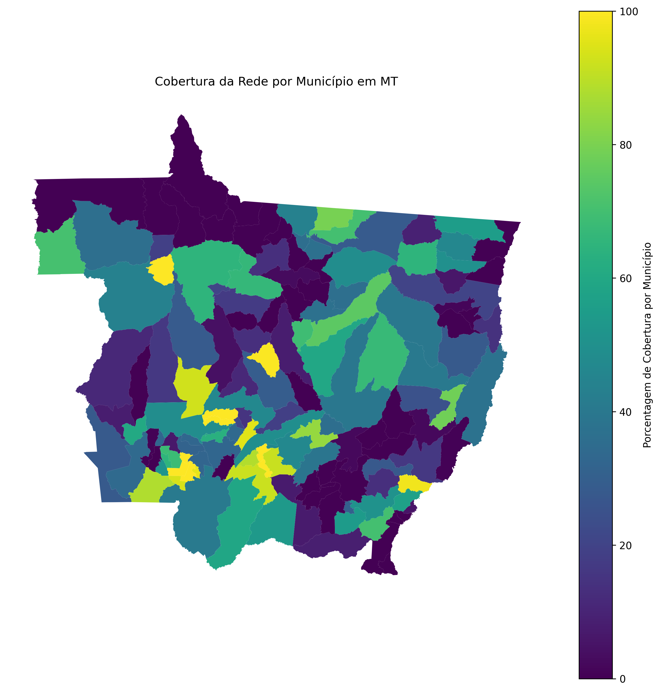

# Análise Geoespacial de Cobertura de Torres



[](https://www.python.org/) 
[](https://git-scm.com/) 
[](https://code.visualstudio.com/)

---

## Descrição do Projeto
Este projeto realiza uma análise geoespacial para simular a cobertura de uma rede de torres sobre os municípios de um estado brasileiro. Desenvolvido em Python, VS Code e UV (Astral) para fins de estudo dos tópicos de análise de dados, geoprocessamento e boas práticas de engenharia de software.

O objetivo é:
- Gerar localizações hipotéticas de torres.
- Modelar a área de cobertura com buffers de 50 km.
- Calcular a cobertura por município e do estado.
- Visualizar os resultados em mapas coropléticos.

---

## Estrutura do Projeto

```text
/geo_coverage_analysis/
│-- /notebooks/ # Notebooks de análise exploratória
│-- /output/ # Resultados
│-- requirements.txt # Dependências do projeto
```

---

## Metodologia 

* Configuração de projeto e ambiente no Windows/VS Code
* Aquisição e reprojeção de dados geoespaciais via geobr
* Geração de pontos simulando torres
* Criação de buffers de 50 km
* Interseção espacial com municípios
* Agregação e cálculo de cobertura
* Visualização final em mapa coroplético

---

## Resultado 

* Área total coberta do estado: 318564.09 km²
* Percentual do estado coberto: 35.21%
* Cobertura detalhada por município
* Mapa final disponível em /output/mapa_final.png
